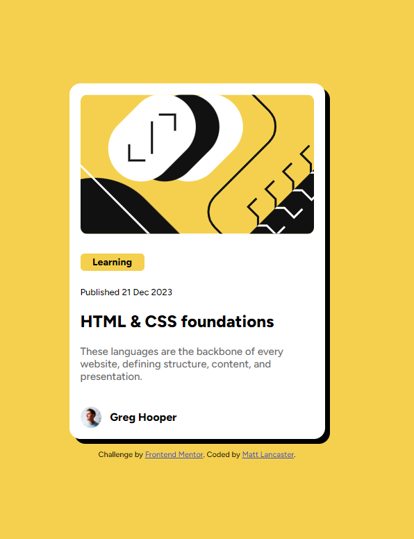

# Frontend Mentor - Blog preview card solution

This is a solution to the [Blog preview card challenge on Frontend Mentor](https://www.frontendmentor.io/challenges/blog-preview-card-ckPaj01IcS). Frontend Mentor challenges help you improve your coding skills by building realistic projects. 

## Table of contents

- [Overview](#overview)
  - [The challenge](#the-challenge)
  - [Screenshot](#screenshot)
  - [Links](#links)
- [My process](#my-process)
  - [Built with](#built-with)
  - [What I learned](#what-i-learned)
- [Author](#author)
- [Acknowledgments](#acknowledgments)

## Overview

### The challenge

Users should be able to:

- See hover and focus states for all interactive elements on the page

### Screenshot

### Links

- Solution URL: [https://github.com/lank81/BlogPreviewCard]
- Live Site URL: [https://lank81.github.io/BlogPreviewCard]

## My process

### Built with

- Semantic HTML5 markup
- CSS custom properties
- Mobile-first workflow
- Google Fonts

### What I learned

This was very similar to the first project (QR Code) so a lot of what was done before could be done for this project.  The thing that threw me off was the user avatar and name at the bottom.  I was trying to set the height/width of the image and align content to mimic the design.  After some time spent doing this unsuccessfully I googled and found info surrounding using a div (footer in my case) and setting it to flexbox row.

## Author

- Frontend Mentor - [@lank81](https://www.frontendmentor.io/profile/lank81)

